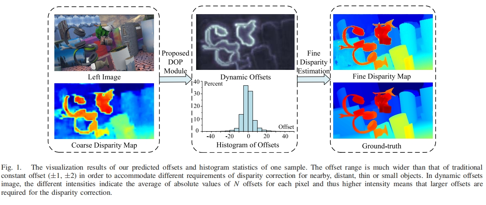

# ADCPNet
Implementation of Adaptive Disparity Candidate Prediction Network

# Paper
https://ieeexplore.ieee.org/document/9504486

Overview of ADCPNet architecture


main idea


# Requirements
1.1 <= Pytorch <= 1.7

# Usage
Train on Sceneflow

```bash
cd ADCPNet
bash sceneflow.sh
```


Train on KITTI 2015
```bash
cd ADCPNet
bash kitti15.sh
```

# Thanks to
Xiaoyang Guo for his excellent work GwcNet and its codes (https://github.com/xy-guo/GwcNet).